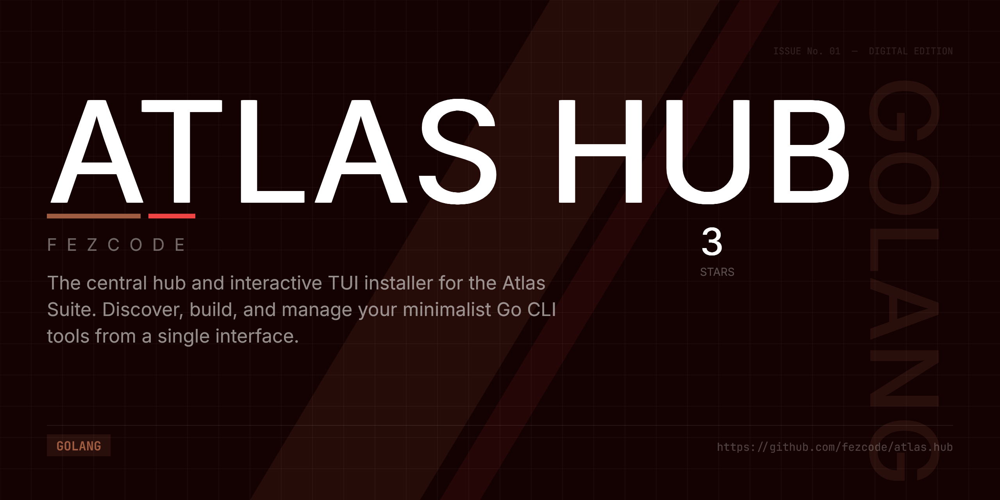

# atlas.hub 🛰️



**atlas.hub** is the central entry point and interactive installer for the **Atlas Suite**. Instead of manually managing a dozen CLI tools, the hub provides a unified interface to discover, build, and maintain your Atlas toolkit with a high-fidelity "Onyx & Gold" aesthetic.


## 🚀 One-Liner Installation

Run the appropriate command for your operating system to bootstrap the Atlas Suite. The script will verify your environment, install `atlas.hub`, and start it immediately.

### 🐧 Linux / 🍎 macOS (Bash)
```bash
curl -fsSL https://raw.githubusercontent.com/fezcode/atlas.hub/main/scripts/install.sh | bash
```

### 🪟 Windows (PowerShell)
```powershell
irm https://raw.githubusercontent.com/fezcode/atlas.hub/main/scripts/install.ps1 | iex
```

---

## 📋 Prerequisites

Before running the installer, ensure you have the following installed and available in your `PATH`:

1.  **Go (1.25+):** Required for building the tools from source. [Download Go](https://go.dev/dl/).
2.  **gobake:** The Atlas build orchestrator. If not found, the installer will attempt to install it for you via `go install github.com/fezcode/gobake/cmd/gobake@latest`.

---

## 🔧 How It Works

Atlas Hub is designed to be a "zero-maintenance" manager. Here is what happens under the hood:

### 1. 🔄 Live Manifest Sync
On every startup, `atlas.hub` connects to GitHub to fetch the latest tool definitions.
- It clones/pulls the `atlas.hub` repository into **`~/.atlas/hub-data/`**.
- This ensures you always see the newest tools and descriptions without needing to update the hub binary itself.
- **Offline Mode:** If you have no internet, it seamlessly falls back to the embedded manifest compiled into the binary.

### 2. 🏗️ Isolated Build Process
When you choose to install a tool:
1.  A secure **temporary directory** is created (e.g., `%TEMP%\atlas-hub-xyz`).
2.  The tool's repository is cloned into this isolated workspace.
3.  Dependencies are resolved via `go mod tidy`.
4.  **`gobake`** is invoked to compile the binary for your specific OS and Architecture with the correct version flags injected.
5.  The final binary is moved to **`~/.atlas/bin/`**.
6.  The temporary directory is strictly cleaned up after the operation.

### 3. 🛡️ Safe Self-Updates
`atlas.hub` can update itself. To handle file locking (especially on Windows), it renames the currently running executable to `.old` before placing the new version. This allows for a smooth, interruption-free update process.

---

## 📂 File Structure

The Atlas ecosystem lives entirely in your home directory:

```text
~/.atlas/
├── bin/            # Where all compiled binaries live (Add this to your PATH!)
│   ├── atlas.hub
│   ├── atlas.todo
│   ├── atlas.stats
│   └── ...
├── hub-data/       # Local cache of the hub repository for manifest data
└── config/         # (Optional) Configuration files for individual tools
```

---

## ✨ Features

- 📦 **Interactive TUI:** A beautiful checklist to select and batch-install tools.
- 📖 **Tool Descriptions:** Toggle detailed descriptions for each tool by pressing `h`.
- 📊 **Detailed Progress:** Real-time status updates for installations.
- ⚙️ **Post-Install setup:** Instructions on adding the bin directory to your PATH.

---

## 🛠️ Included Tools

The Atlas Hub currently manages the following tools:
- **atlas.todo**: Fast, minimalist task manager.
- **atlas.stats**: Real-time system monitoring.
- **atlas.websearch**: Interactive CLI search (Wiki, Reddit, HN).
- **atlas.compass**: Secure local-first password manager.
- **atlas.clock**: High-visibility world clock.
- **atlas.cam**: Terminal webcam viewer & ASCII camera.
- **atlas.games**: Shell-based game collection.
- **atlas.bench**: High-performance CLI benchmarking.
- **atlas.radar**: Git workspace monitor.
- **atlas.otp**: Secure TOTP (2FA) manager.
- **atlas.diff**: Side-by-side terminal diff tool.
- **atlas.cat**: High-performance terminal text viewer.
- **atlas.ed**: High-performance terminal text editor.
- **atlas.git**: Comprehensive TUI git client.
- **atlas.ip**: Fast, minimal tool to fetch IP and geolocation.
- **atlas.sand**: Terminal-based falling sand simulator.
- **atlas.sql**: Terminal-based SQL client for SQLite/PostgreSQL.
- **atlas.chat**: Modern TUI chat terminal.
- **atlas.color**: Interactive TUI color picker and converter.
- **atlas.screensaver**: Collection of aesthetic terminal screensavers.
- **atlas.facade**: Retro-future Pip-Boy style mock API server.
- **atlas.pq**: Minimalist command-line PIML processor.
- **atlas.hash**: Terminal utility for computing file hashes.
- **atlas.grave**: High-fidelity, interactive process reaper.
- **atlas.radio**: High-fidelity world radio receiver.
- **atlas.deck**: Interactive TUI command deck for workflows.
- **atlas.convert**: Minimalist terminal image conversion utility.
- **atlas.conquistador**: Terminal-based file explorer.
- **atlas.horizon**: Environmental and weather dashboard.

---

## 🏗️ Manual Build
If you prefer to build manually:
```bash
git clone https://github.com/fezcode/atlas.hub
cd atlas.hub
gobake build
./build/atlas.hub-windows-amd64.exe  # Or your platform equivalent
```

## 📄 License
MIT License - see [LICENSE](LICENSE) for details.
